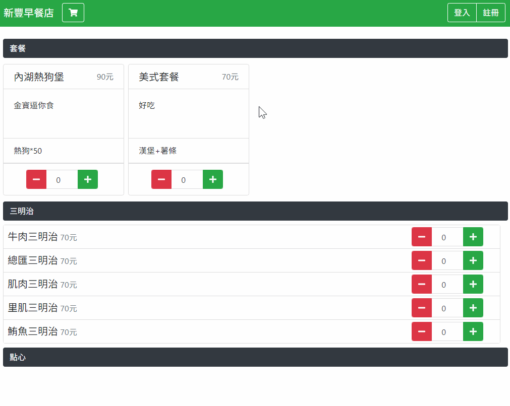
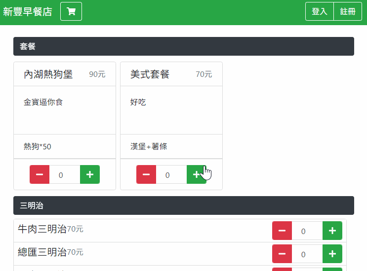
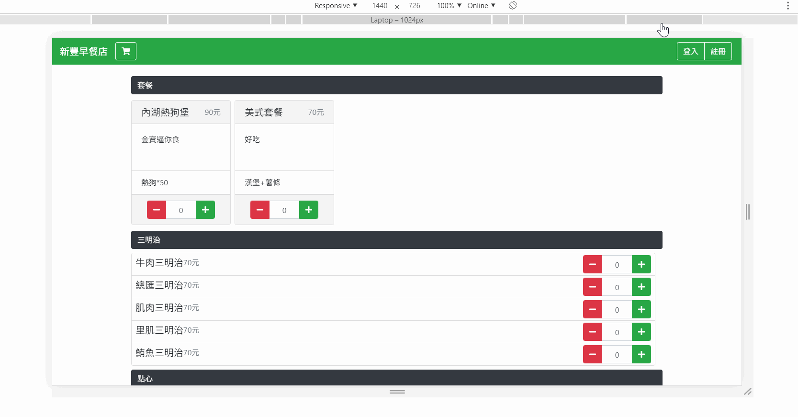

# Xinfeng-Breakfast-Online-Orderer

### Related Link

- [Trello](https://trello.com/b/PIKKNgiY/xinfeng-breakfast-online-orderer)

---

## About this Branch

This is Luo Jie's branch, which is dedicated to front-end of *[main](src/main.html)*, *[login](src/login.html)* and *[register](src/register.html)* page.

From this [commit](https://github.com/a129123659/Xinfeng-Breakfast-Online-Orderer/commit/2ce7e0bb1fbd8971c52c5dd577fe3deb513d9878) on, I'll will **only** commit files related to what this branch is responsible for. I believe by simplify the structure of this branch you shall be able to **quickly find** what you are expecting from me.

Should you want to test these pages, simply copy files in *[my build branch](https://github.com/a129123659/Xinfeng-Breakfast-Online-Orderer/tree/LuoJie-Build)* to whatever your project folder is in *XAMPP*, then open the service should do the trick.

Any issue (especially merging with our whole app) is ~~unwanted~~ welcome.

### Tool used

Refactored (majorly) with the following tools

- Bootstrap
- Vue
- Scss
- font awesome
- webpack

---

## Exhibition

### Main page

#### modal window

#### cart badge

#### RWD

